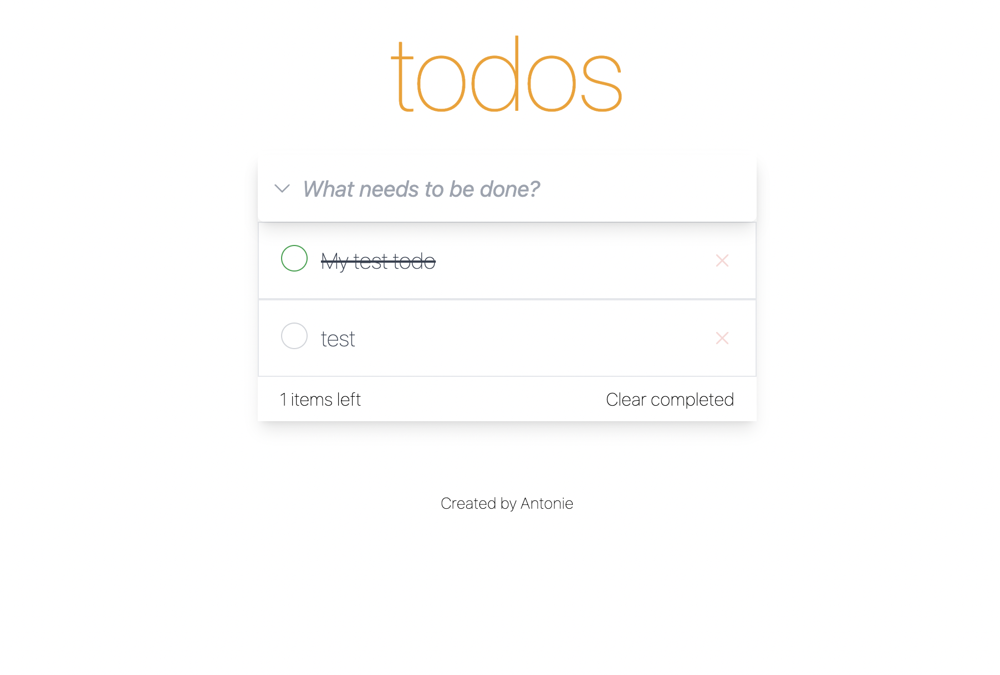

# Pet-Todo
This project is designed to strengthen the fundamental knowledge of React. The application allows you to add and remove items that you need to complete.

## Content
- [Technology](#technology)
- [Get Start](#get-start)

## Technology
- [React Router](https://reactrouter.com/en/main)
- [TypeScript](https://www.typescriptlang.org/)
- [Tailwind CSS](https://tailwindcss.com/)
- [Heroicons](https://heroicons.com/)

## Get Start
Install npm-package using comand:
```sh
$ npm install
```

Start the project with comand: 
```sh
$ npm start
```


